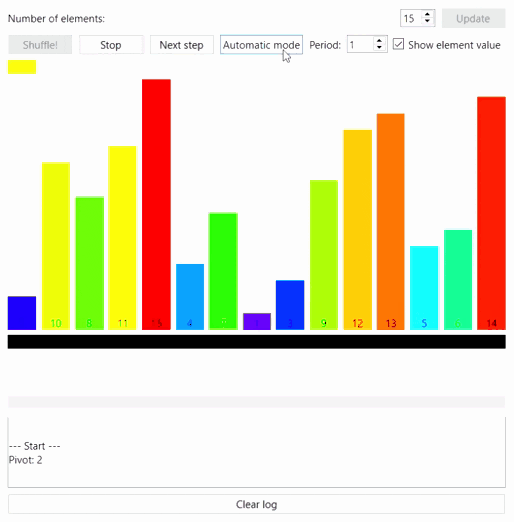

# QQuickSort

A simple GUI visualization of QuickSort algorithm.

It only uses PySide6, it does not have any other external dependency.

## How to run

Install requirements:
- Python 3.10 [> Download <](https://www.python.org/downloads/)

- PySide6: ``pip install PySide6``

Run code:
``python main.py``

## To do:

- Make program bullerproof. 
It has not been fully tested due to lack of time. 
It sometimes crashes

- Choose pivot dynamically 
- Clean code
- Improve GUI
- Add comparison and swapping operation counter